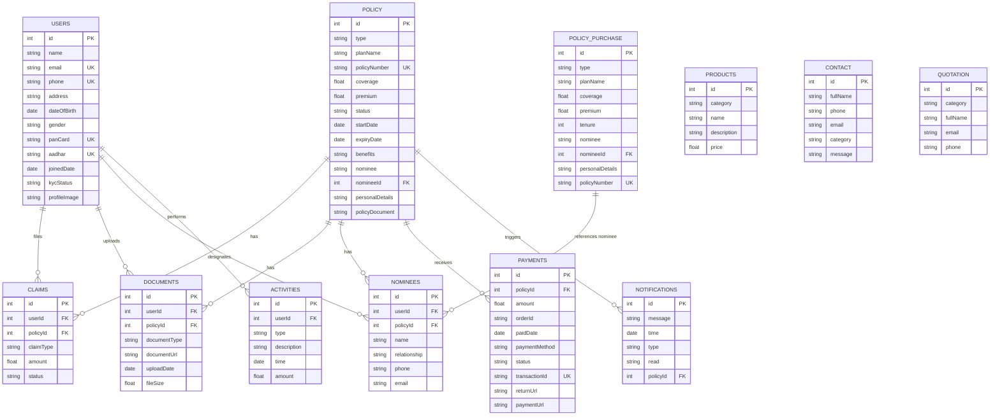

# Insurance AI Management System

## 📋 Table of Contents
1. [Project Overview](#project-overview)
2. [Architecture](#architecture)
3. [Technology Stack](#technology-stack)
4. [Project Structure](#project-structure)
5. [Database Schema](#database-schema)
6. [API Documentation](#api-documentation)
7. [Frontend Architecture](#frontend-architecture)
8. [Business Logic](#business-logic)
9. [Features](#features)
10. [Setup Instructions](#setup-instructions)
11. [Authentication & Authorization](#authentication--authorization)
12. [Data Flow](#data-flow)

---

## 🎯 Project Overview

This is a comprehensive **Insurance Management System** built with a **FastAPI backend** and **React TypeScript frontend**. The system enables users to manage insurance policies, file claims, make payments, and interact with an AI assistant for customer support. It supports three types of insurance: Life Insurance, Car Insurance, and Health Insurance.

### Key Capabilities
- **Policy Management**: Create, view, update, and purchase insurance policies
- **Claims Processing**: Submit, track, and manage insurance claims
- **Payment Integration**: Handle premium payments and transactions
- **User Management**: Profile management with KYC verification
- **Document Management**: Upload and manage policy documents
- **Notifications**: Real-time notifications for policy updates
- **AI Assistant**: Interactive chatbot for customer support
- **Admin Dashboard**: Administrative interface for managing users and claims

---

## 🏗️ Architecture

### System Architecture Overview

```
┌─────────────────────────────────────────────────────────────┐
│                     React Frontend (UI)                      │
│  ┌──────────────┐  ┌──────────────┐  ┌──────────────┐     │
│  │   Pages      │  │  Components  │  │  Services    │     │
│  │              │  │              │  │   (API)      │     │
│  └──────────────┘  └──────────────┘  └──────────────┘     │
│         │                 │                    │            │
│         └─────────────────┼────────────────────┘            │
│                           │                                 │
└───────────────────────────┼─────────────────────────────────┘
                            │ HTTP/REST API
                            │
┌───────────────────────────┼─────────────────────────────────┐
│                    FastAPI Backend                          │
│  ┌──────────────┐  ┌──────────────┐  ┌──────────────┐     │
│  │   Routers    │  │     CRUD     │  │   Models     │     │
│  │   (API)      │  │   (Business) │  │  (Database)  │     │
│  └──────────────┘  └──────────────┘  └──────────────┘     │
│         │                 │                    │            │
│         └─────────────────┼────────────────────┘            │
│                           │                                 │
└───────────────────────────┼─────────────────────────────────┘
                            │
                            │ SQLAlchemy ORM
                            │
┌───────────────────────────┼─────────────────────────────────┐
│              SQLite Database (insurance.db)                 │
│  ┌─────────────────────────────────────────────────────┐   │
│  │  Users, Policies, Claims, Payments, Documents, etc. │   │
│  └─────────────────────────────────────────────────────┘   │
└─────────────────────────────────────────────────────────────┘
```

### Backend Architecture

The backend follows a **modular REST API architecture** with clear separation of concerns:

1. **Routers Layer**: Handles HTTP requests and responses
2. **CRUD Layer**: Business logic and database operations
3. **Models Layer**: Database schema definitions
4. **Schemas Layer**: Pydantic models for data validation

### Frontend Architecture

The frontend uses a **component-based architecture** with:

1. **Pages**: Route-level components
2. **Components**: Reusable UI components
3. **Services**: API communication layer
4. **Contexts**: State management (Auth)
5. **UI Components**: Radix UI based component library

---

## 🛠️ Technology Stack

### Backend
- **FastAPI**: Modern, fast web framework for building APIs
- **SQLAlchemy**: SQL toolkit and ORM
- **SQLite**: Lightweight database
- **Pydantic**: Data validation using Python type annotations
- **Python 3.x**: Programming language

### Frontend
- **React 18.3.1**: UI library
- **TypeScript**: Type-safe JavaScript
- **Vite**: Build tool and dev server
- **React Router DOM**: Client-side routing
- **Tailwind CSS**: Utility-first CSS framework
- **Radix UI**: Unstyled, accessible UI components
- **Lucide React**: Icon library
- **Sonner**: Toast notifications
- **Motion (Framer Motion)**: Animation library
- **React Hook Form**: Form handling

---

## 📁 Project Structure

```
Insurance AI/
│
├── Innsurance Backend Fast API/
│   └── fastapi_insurance_project_backend/
│       ├── main.py                 # FastAPI application entry point
│       ├── database.py             # Database configuration and session management
│       ├── models.py               # SQLAlchemy database models
│       ├── schemas.py              # Pydantic schemas for request/response validation
│       ├── crud.py                 # CRUD operations (business logic)
│       ├── routers/                # API route handlers
│       │   ├── users.py           # User management endpoints
│       │   ├── policy.py          # Policy management endpoints
│       │   ├── claims.py          # Claims management endpoints
│       │   ├── products.py        # Product catalog endpoints
│       │   ├── contact.py         # Contact form endpoints
│       │   ├── quotation.py       # Quotation request endpoints
│       │   ├── documents.py       # Document upload endpoints
│       │   ├── nominee.py         # Nominee management endpoints
│       │   ├── activities.py      # User activity tracking endpoints
│       │   ├── notifications.py   # Notification endpoints
│       │   └── payments.py        # Payment processing endpoints
│       └── insurance.db           # SQLite database file (generated)
│
└── React UI-User/
    ├── src/
    │   ├── main.tsx               # React application entry point
    │   ├── App.tsx                # Main app component with routing
    │   ├── index.css              # Global styles
    │   ├── components/
    │   │   ├── pages/             # Page components
    │   │   │   ├── Homepage.tsx
    │   │   │   ├── Login.tsx
    │   │   │   ├── Dashboard.tsx
    │   │   │   ├── Profile.tsx
    │   │   │   ├── LifeInsurance.tsx
    │   │   │   ├── CarInsurance.tsx
    │   │   │   ├── HealthInsurance.tsx
    │   │   │   ├── Quotes.tsx
    │   │   │   ├── ClaimsSubmit.tsx
    │   │   │   ├── ClaimsTrack.tsx
    │   │   │   ├── CarClaim.tsx
    │   │   │   ├── AdminDashboard.tsx
    │   │   │   ├── Contact.tsx
    │   │   │   ├── AboutUs.tsx
    │   │   │   ├── FAQ.tsx
    │   │   │   └── Terms.tsx
    │   │   ├── AIAssistant.tsx    # AI chat assistant component
    │   │   ├── Navigation.tsx     # Navigation bar
    │   │   ├── Footer.tsx         # Footer component
    │   │   ├── ProtectedRoute.tsx # Route protection component
    │   │   └── ui/                # Reusable UI components (Radix UI)
    │   ├── contexts/
    │   │   └── AuthContext.tsx    # Authentication context
    │   ├── services/
    │   │   └── api.ts             # API service functions
    │   └── styles/
    │       └── globals.css        # Global CSS styles
    ├── package.json               # Node.js dependencies
    ├── vite.config.ts             # Vite configuration
    └── index.html                 # HTML entry point
```

---

## 🗄️ Database Schema

### Database Models

#### 1. **User Model**
```python
- id: Integer (Primary Key)
- name: String
- email: String (Unique, Indexed)
- phone: String (Unique, Indexed)
- address: String
- dateOfBirth: Date
- gender: String
- panCard: String (Unique, Indexed)
- aadhar: String (Unique, Indexed)
- joinedDate: Date
- kycStatus: Enum (pending/verified)
- profileImage: String (Nullable)
```

#### 2. **Policy Model**
```python
- id: Integer (Primary Key)
- type: Enum (life_insurance/vehicle_insurance/health_insurance)
- planName: String
- policyNumber: String (Unique, Indexed)
- coverage: Float
- premium: Float
- status: String
- startDate: Date
- expiryDate: Date
- benefits: JSON (Nullable)
- nominee: String (Nullable)
- nomineeId: Integer (ForeignKey to Nominees)
- personalDetails: JSON
- policyDocument: String (Nullable)
```

#### 3. **PolicyPurchase Model**
```python
- id: Integer (Primary Key)
- type: Enum (PolicyType)
- planName: String
- coverage: Float
- premium: Float
- tenure: Integer
- nominee: String (Nullable)
- nomineeId: Integer (ForeignKey to Nominees)
- personalDetails: JSON
- policyNumber: String (Unique, Indexed)
```

#### 4. **Claim Model**
```python
- id: Integer (Primary Key)
- userId: Integer (ForeignKey to Users)
- policyId: Integer (ForeignKey to Policy)
- claimType: String
- amount: Float
- status: String
```

#### 5. **Product Model**
```python
- id: Integer (Primary Key)
- category: Enum (PolicyType)
- name: String
- description: String
- price: Float
```

#### 6. **Contact Model**
```python
- id: Integer (Primary Key)
- fullName: String
- phone: String
- email: String
- category: Enum (general_enquiry/claim_support/policy_information/technical_support/complaint)
- message: String
```

#### 7. **Quotation Model**
```python
- id: Integer (Primary Key)
- category: Enum (PolicyType)
- fullName: String
- email: String
- phone: String
```

#### 8. **Documents Model**
```python
- id: Integer (Primary Key)
- userId: Integer (ForeignKey to Users)
- policyId: Integer (ForeignKey to Policy)
- documentType: String
- documentUrl: String
- uploadDate: Date
- fileSize: Float
```

#### 9. **Nominee Model**
```python
- id: Integer (Primary Key)
- userId: Integer (ForeignKey to Users)
- policyId: Integer (ForeignKey to Policy)
- name: String
- relationship: String
- phone: String
- email: String
```

#### 10. **Activities Model**
```python
- id: Integer (Primary Key)
- userId: Integer (ForeignKey to Users)
- type: Enum (payment/policy/claim/health)
- description: String
- time: Date
- amount: Float
```

#### 11. **Notification Model**
```python
- id: Integer (Primary Key)
- message: String
- time: Date
- type: Enum (warning/success/info/error)
- read: Boolean (Default: False)
- policyId: Integer (ForeignKey to Policy, Nullable)
```

#### 12. **Payments Model**
```python
- id: Integer (Primary Key)
- policyId: Integer (ForeignKey to Policy)
- amount: Float
- orderId: String
- paidDate: Date
- paymentMethod: String
- status: Enum (pending/success/failed/cancelled)
- transactionId: String (Unique, Indexed)
- returnUrl: String
- paymentUrl: String
```

### Database Relationships

```
Users (1) ──< (Many) Policies
Users (1) ──< (Many) Claims
Users (1) ──< (Many) Documents
Users (1) ──< (Many) Nominees
Users (1) ──< (Many) Activities

Policies (1) ──< (Many) Claims
Policies (1) ──< (Many) Documents
Policies (1) ──< (Many) Nominees
Policies (1) ──< (Many) Payments
Policies (1) ──< (Many) Notifications
```

### Entity-Relationship (ER) Diagram

The following ER diagram visualizes the database structure and relationships. This diagram uses Mermaid syntax and will render automatically in GitHub, GitLab, and other Markdown viewers that support Mermaid diagrams.

**Note**: If the diagram doesn't render in your viewer, refer to the [Database Relationships](#database-relationships) section above for a text-based representation.



### ER Diagram Notation

The ER diagram uses the following notation:
- **PK**: Primary Key (unique identifier for each record)
- **FK**: Foreign Key (references a primary key in another table)
- **UK**: Unique Key (ensures uniqueness of a field)
- **||--o{**: One-to-Many relationship (one entity can have many related entities, optional on "many" side)
- **}o--||**: Many-to-One relationship (many entities belong to one entity, optional on "one" side)
- **}o--o{**: Many-to-Many relationship (optional on both sides)
- **||--||**: One-to-One relationship (one entity relates to exactly one entity)

### ER Diagram Explanation

The ER diagram above shows the complete database structure with all entities and their relationships:

#### **Core Entities:**
1. **USERS**: Central entity storing user information
2. **POLICY**: Insurance policies purchased by users
3. **POLICY_PURCHASE**: Temporary records for policy purchases before activation
4. **CLAIMS**: Insurance claims filed by users
5. **PRODUCTS**: Insurance products catalog
6. **NOMINEES**: Beneficiaries designated for policies

#### **Supporting Entities:**
7. **DOCUMENTS**: Documents uploaded by users (policy documents, claim documents, etc.)
8. **ACTIVITIES**: User activity logs (payments, policy purchases, claims, etc.)
9. **NOTIFICATIONS**: System notifications for users
10. **PAYMENTS**: Payment transactions for policy premiums
11. **CONTACT**: Contact form inquiries
12. **QUOTATION**: Insurance quotation requests

#### **Key Relationships:**
- **One-to-Many (1:N)**:
  - User → Claims (one user can file multiple claims)
  - User → Documents (one user can upload multiple documents)
  - User → Nominees (one user can designate multiple nominees)
  - User → Activities (one user can have multiple activities)
  - Policy → Claims (one policy can have multiple claims)
  - Policy → Documents (one policy can have multiple documents)
  - Policy → Payments (one policy can have multiple payments)
  - Policy → Notifications (one policy can trigger multiple notifications)
  - Policy → Nominees (one policy can have multiple nominees)

- **Many-to-One (N:1)**:
  - Claims → User (many claims belong to one user)
  - Claims → Policy (many claims belong to one policy)
  - Documents → User (many documents belong to one user)
  - Documents → Policy (many documents belong to one policy)
  - Payments → Policy (many payments belong to one policy)
  - Nominees → User (many nominees belong to one user)
  - Nominees → Policy (many nominees belong to one policy)

- **Optional Relationships (o)**:
  - Policy → Nominee (policy can optionally reference a primary nominee via nomineeId)
  - PolicyPurchase → Nominee (policy purchase can optionally reference a nominee)
  - Notification → Policy (notification can optionally be related to a policy)

- **Many-to-Many (Indirect)**:
  - Users ↔ Policies (relationship is indirect through Claims, Documents, and Nominees)
  - **Note**: The Policy model doesn't have a direct `userId` foreign key. The relationship between Users and Policies exists indirectly through:
    - Claims (users file claims on policies)
    - Documents (users upload documents for policies)
    - Nominees (users designate nominees for policies)
  - **Design Consideration**: For a complete insurance system, it's recommended to add a `userId` field to the Policy table to establish a direct ownership relationship.

#### **Primary Keys (PK):**
- All entities have an `id` field as the primary key

#### **Foreign Keys (FK):**
- `userId`: References USERS.id
- `policyId`: References POLICY.id
- `nomineeId`: References NOMINEES.id

#### **Unique Keys (UK):**
- `email`, `phone`, `panCard`, `aadhar` in USERS table
- `policyNumber` in POLICY and POLICY_PURCHASE tables
- `transactionId` in PAYMENTS table

---

## 🔌 API Documentation

### Base URL
```
Backend: http://localhost:8000 (default FastAPI port)
Frontend: http://localhost:3000 (Vite dev server)
```

### API Endpoints

#### **Users API** (`/users`)

| Method | Endpoint | Description | Request Body | Response |
|--------|----------|-------------|--------------|----------|
| POST | `/users/` | Create new user | UserCreate schema | Success message |
| GET | `/users/` | Get all users | - | List of users |
| GET | `/users/{userId}` | Get user by ID | - | User object |
| PUT | `/users/{userId}` | Update user | UserUpdate schema | Success message |
| DELETE | `/users/{userId}` | Delete user | - | Success message |

**UserCreate Schema:**
```json
{
  "name": "string",
  "email": "string",
  "phone": "string",
  "address": "string",
  "dateOfBirth": "YYYY-MM-DD",
  "gender": "string",
  "panCard": "string",
  "aadhar": "string",
  "joinedDate": "YYYY-MM-DD",
  "kycStatus": "pending|verified",
  "profileImage": "string (optional)"
}
```

#### **Policy API** (`/policy`)

| Method | Endpoint | Description | Request Body | Response |
|--------|----------|-------------|--------------|----------|
| POST | `/policy/` | Create policy | PolicyCreate schema | Policy object |
| POST | `/policy/purchase` | Purchase policy | PolicyPurchaseCreate schema | Policy purchase response |
| GET | `/policy/` | Get all policies | - | List of policies |
| GET | `/policy/{policy_id}` | Get policy by ID | - | Policy object |
| PUT | `/policy/{policy_id}` | Update policy | PolicyUpdate schema | Success message |
| DELETE | `/policy/{policy_id}` | Delete policy | - | Success message |

**PolicyPurchaseCreate Schema:**
```json
{
  "type": "life_insurance|vehicle_insurance|health_insurance",
  "planName": "string",
  "coverage": 0.0,
  "premium": 0.0,
  "tenure": 0,
  "nominee": "string (optional)",
  "nomineeId": 0 (optional),
  "personalDetails": {
    "name": "string",
    "dateOfBirth": "YYYY-MM-DD",
    "gender": "male|female|other"
  },
  "policyNumber": "string"
}
```

**Policy Number Generation:**
- Format: `POL{YYYYMMDDHHMMSS}{4 random digits}`
- Example: `POL202501011200001234`

#### **Claims API** (`/claims`)

| Method | Endpoint | Description | Request Body | Response |
|--------|----------|-------------|--------------|----------|
| POST | `/claims/` | Create claim | ClaimCreate schema | Claim ID |
| GET | `/claims/` | Get all claims | - | List of claims |
| GET | `/claims/{claim_id}` | Get claim by ID | - | Claim object |
| PUT | `/claims/{claim_id}` | Update claim | ClaimUpdate schema | Success message |
| DELETE | `/claims/{claim_id}` | Delete claim | - | Success message |

**ClaimCreate Schema:**
```json
{
  "userId": 0,
  "policyId": 0,
  "claimType": "string",
  "amount": 0.0,
  "status": "string"
}
```

#### **Products API** (`/products`)

| Method | Endpoint | Description | Request Body | Response |
|--------|----------|-------------|--------------|----------|
| POST | `/products/` | Create product | ProductCreate schema | Product ID |
| GET | `/products/` | Get all products | - | List of products |
| GET | `/products/{product_id}` | Get product by ID | - | Product object |
| PUT | `/products/{product_id}` | Update product | ProductUpdate schema | Success message |
| DELETE | `/products/{product_id}` | Delete product | - | Success message |

#### **Contact API** (`/contact`)

| Method | Endpoint | Description | Request Body | Response |
|--------|----------|-------------|--------------|----------|
| POST | `/contact/` | Create contact inquiry | ContactCreate schema | Contact ID |
| GET | `/contact/` | Get all contacts | - | List of contacts |
| GET | `/contact/{contact_id}` | Get contact by ID | - | Contact object |
| PUT | `/contact/{contact_id}` | Update contact | ContactUpdate schema | Success message |
| DELETE | `/contact/{contact_id}` | Delete contact | - | Success message |

**ContactCreate Schema:**
```json
{
  "fullName": "string",
  "phone": "string",
  "email": "string",
  "category": "general_enquiry|claim_support|policy_information|technical_support|complaint",
  "message": "string"
}
```

#### **Quotation API** (`/quotation`)

| Method | Endpoint | Description | Request Body | Response |
|--------|----------|-------------|--------------|----------|
| POST | `/quotation/` | Request quotation | QuotationCreate schema | Quotation ID |
| GET | `/quotation/` | Get all quotations | - | List of quotations |
| GET | `/quotation/{quotation_id}` | Get quotation by ID | - | Quotation object |
| PUT | `/quotation/{quotation_id}` | Update quotation | QuotationUpdate schema | Success message |
| DELETE | `/quotation/{quotation_id}` | Delete quotation | - | Success message |

#### **Documents API** (`/documents`)

| Method | Endpoint | Description | Request Body | Response |
|--------|----------|-------------|--------------|----------|
| POST | `/documents/` | Upload document | DocumentCreate schema | Document response |
| GET | `/documents/` | Get all documents | - | List of documents |
| GET | `/documents/{document_id}` | Get document by ID | - | Document object |

#### **Nominees API** (`/nominees`)

| Method | Endpoint | Description | Request Body | Response |
|--------|----------|-------------|--------------|----------|
| POST | `/nominees/` | Create nominee | NomineeCreate schema | Nominee ID |
| GET | `/nominees/` | Get all nominees | - | List of nominees |
| GET | `/nominees/{nominee_id}` | Get nominee by ID | - | Nominee object |
| PUT | `/nominees/{nominee_id}` | Update nominee | NomineeUpdate schema | Success message |
| DELETE | `/nominees/{nominee_id}` | Delete nominee | - | Success message |

#### **Activities API** (`/activities`)

| Method | Endpoint | Description | Request Body | Response |
|--------|----------|-------------|--------------|----------|
| POST | `/activities/` | Create activity | ActivityCreate schema | Activity response |
| GET | `/activities/` | Get all activities | - | List of activities |
| GET | `/activities/{activity_id}` | Get activity by ID | - | Activity object |

#### **Notifications API** (`/notifications`)

| Method | Endpoint | Description | Request Body | Response |
|--------|----------|-------------|--------------|----------|
| POST | `/notifications/` | Create notification | NotificationCreate schema | Notification object |
| GET | `/notifications/` | Get all notifications | - | List of notifications |
| GET | `/notifications/{notification_id}` | Get notification by ID | - | Notification object |

#### **Payments API** (`/payments`)

| Method | Endpoint | Description | Request Body | Response |
|--------|----------|-------------|--------------|----------|
| POST | `/payments/` | Create payment | PaymentCreate schema | Payment response |
| GET | `/payments/` | Get all payments | - | List of payments |
| GET | `/payments/{payment_id}` | Get payment by ID | - | Payment object |

**PaymentCreate Schema:**
```json
{
  "policyId": 0,
  "amount": 0.0,
  "orderId": "string",
  "paidDate": "YYYY-MM-DD",
  "paymentMethod": "string",
  "status": "pending|success|failed|cancelled",
  "transactionId": "string",
  "returnUrl": "string",
  "paymentUrl": "string"
}
```

---

## 🎨 Frontend Architecture

### Component Hierarchy

```
App
├── AuthProvider (Context)
├── Router
│   ├── Navigation
│   ├── Routes
│   │   ├── Public Routes
│   │   │   ├── Homepage
│   │   │   ├── Login
│   │   │   ├── AboutUs
│   │   │   ├── Contact
│   │   │   ├── FAQ
│   │   │   └── Terms
│   │   └── Protected Routes
│   │       ├── Dashboard
│   │       ├── Profile
│   │       ├── LifeInsurance
│   │       ├── CarInsurance
│   │       ├── HealthInsurance
│   │       ├── Quotes
│   │       ├── ClaimsSubmit
│   │       ├── ClaimsTrack
│   │       ├── CarClaim
│   │       └── AdminDashboard (Admin Only)
│   ├── Footer
│   └── AIAssistant
└── Toaster
```

### Key Frontend Components

#### 1. **AuthContext** (`contexts/AuthContext.tsx`)
- Manages user authentication state
- Provides `login`, `logout`, `register`, and `updateUser` functions
- Stores user data in localStorage
- Handles user roles (user/admin)

#### 2. **ProtectedRoute** (`components/ProtectedRoute.tsx`)
- Protects routes that require authentication
- Redirects to login if user is not authenticated
- Supports admin-only routes with `requireAdmin` prop

#### 3. **AIAssistant** (`components/AIAssistant.tsx`)
- Floating chat assistant
- Provides quick answers to common insurance questions
- Simulated AI responses based on keyword matching
- Quick question buttons for common queries

#### 4. **Dashboard** (`components/pages/Dashboard.tsx`)
- Main user dashboard
- Displays policies, activities, and notifications
- Shows total coverage, monthly premium, and active policies
- Quick action buttons for common tasks

#### 5. **API Service** (`services/api.ts`)
- Centralized API communication layer
- Mock API functions (currently simulated)
- Ready for integration with backend
- Organized by resource type (users, policies, claims, etc.)

### Routing Structure

#### Public Routes
- `/` - Homepage
- `/login` - Login page
- `/about` - About Us
- `/contact` - Contact form
- `/faq` - FAQ page
- `/terms` - Terms and conditions

#### Protected Routes (Require Login)
- `/dashboard` - User dashboard
- `/profile` - User profile
- `/life-insurance` - Life insurance page
- `/car-insurance` - Car insurance page
- `/health-insurance` - Health insurance page
- `/quotes` - Insurance quotes
- `/confirmation` - Policy confirmation
- `/claims/submit` - Submit claim
- `/claims/track` - Track claims
- `/claims/car` - Car claim specific page

#### Admin Routes (Require Admin Role)
- `/admin` - Admin dashboard

---

## 💼 Business Logic

### 1. User Registration & Management

**Flow:**
1. User provides personal information (name, email, phone, address, DOB, gender, PAN, Aadhar)
2. System checks for duplicate email/phone
3. User is created with `kycStatus: pending`
4. KYC verification can be updated to `verified` by admin

**Business Rules:**
- Email and phone must be unique
- PAN and Aadhar must be unique
- KYC status starts as `pending`
- Profile image is optional

### 2. Policy Purchase

**Flow:**
1. User selects insurance type (Life/Car/Health)
2. User provides personal details and coverage requirements
3. System generates unique policy number: `POL{timestamp}{4 random digits}`
4. Policy purchase record is created
5. User can complete payment to activate policy

**Policy Number Generation:**
```python
policy_number = "POL" + datetime.now().strftime("%Y%m%d%H%M%S") + ''.join(random.choices(string.digits, k=4))
```

**Business Rules:**
- Policy number must be unique
- Personal details are stored as JSON
- Nominee information is optional
- Policy requires payment to be activated

### 3. Claims Processing

**Flow:**
1. User selects policy for claim
2. User provides claim details (type, amount, description)
3. Claim is created with status `pending`
4. Admin reviews and updates status (approved/rejected)
5. User can track claim status

**Business Rules:**
- Claim must be associated with an active policy
- Claim amount cannot exceed policy coverage
- Claim status can be: `pending`, `approved`, `rejected`, `under_review`

### 4. Payment Processing

**Flow:**
1. User initiates payment for policy premium
2. Payment record is created with status `pending`
3. Payment gateway integration (currently simulated)
4. Payment status is updated based on gateway response
5. Transaction ID is stored for reference

**Business Rules:**
- Payment must be associated with a policy
- Payment status: `pending`, `success`, `failed`, `cancelled`
- Transaction ID must be unique
- Payment URL and return URL are stored for gateway integration

### 5. Document Management

**Flow:**
1. User uploads document (policy document, claim document, etc.)
2. Document metadata is stored (type, URL, size, upload date)
3. Document is associated with user and policy
4. Documents can be retrieved for viewing/downloading

**Business Rules:**
- Documents must be associated with a user and policy
- Document type identifies the purpose (policy_document, claim_document, etc.)
- File size is stored for reference

### 6. Nominee Management

**Flow:**
1. User adds nominee information for a policy
2. Nominee details (name, relationship, phone, email) are stored
3. Nominee is associated with user and policy
4. Nominee can be updated or deleted

**Business Rules:**
- Nominee must be associated with a user and policy
- Relationship field describes relationship to policyholder
- Multiple nominees can be added per policy

### 7. Activity Tracking

**Flow:**
1. System automatically creates activity records for user actions
2. Activities are categorized by type (payment, policy, claim, health)
3. Activities include description, timestamp, and amount (if applicable)
4. Activities are displayed in user dashboard

**Activity Types:**
- `payment`: Premium payments
- `policy`: Policy purchases and updates
- `claim`: Claim submissions and updates
- `health`: Health check-ups and related activities

### 8. Notifications

**Flow:**
1. System generates notifications for important events
2. Notifications are categorized by type (warning, success, info, error)
3. Notifications can be associated with a policy
4. Notifications are marked as read/unread
5. Notifications are displayed in user dashboard

**Notification Types:**
- `warning`: Renewal reminders, payment due
- `success`: Payment successful, claim approved
- `info`: General information
- `error`: Payment failed, claim rejected

### 9. Quotation Requests

**Flow:**
1. User requests insurance quotation
2. User provides basic information (name, email, phone, category)
3. Quotation request is stored
4. Admin can process quotation and contact user

**Business Rules:**
- Quotation is a lead generation mechanism
- Category determines type of insurance (Life/Car/Health)
- No pricing calculation in current implementation (can be added)

### 10. Contact Form

**Flow:**
1. User submits contact form with inquiry
2. Contact inquiry is categorized (general, claim support, policy information, technical support, complaint)
3. Contact inquiry is stored for admin review
4. Admin can respond to inquiries

**Contact Categories:**
- `general_enquiry`: General questions
- `claim_support`: Claim-related inquiries
- `policy_information`: Policy-related questions
- `technical_support`: Technical issues
- `complaint`: Complaints

---

## ✨ Features

### User Features
1. **User Registration & Login**
   - Email-based authentication
   - Profile management
   - KYC verification status

2. **Policy Management**
   - Browse insurance products (Life, Car, Health)
   - Purchase policies
   - View policy details
   - Download policy documents
   - Policy renewal reminders

3. **Claims Management**
   - Submit insurance claims
   - Track claim status
   - Upload claim documents
   - View claim history

4. **Payment Management**
   - Pay policy premiums
   - View payment history
   - Payment status tracking
   - Transaction history

5. **Dashboard**
   - Overview of policies
   - Recent activities
   - Notifications
   - Quick actions

6. **AI Assistant**
   - Interactive chatbot
   - Quick answers to common questions
   - Policy information
   - Claim assistance

### Admin Features
1. **Admin Dashboard**
   - User management
   - Policy management
   - Claims management
   - Payment tracking
   - Statistics and analytics

2. **User Management**
   - View all users
   - Update user information
   - KYC verification
   - User status management

3. **Claims Management**
   - Review claims
   - Approve/reject claims
   - Update claim status
   - View claim details

4. **Product Management**
   - Create insurance products
   - Update product information
   - Manage product catalog

---

## 🚀 Setup Instructions

### Backend Setup

1. **Navigate to backend directory:**
   ```bash
   cd "Innsurance Backend Fast API/fastapi_insurance_project_backend"
   ```

2. **Create virtual environment (recommended):**
   ```bash
   python -m venv venv
   # Windows
   venv\Scripts\activate
   # Linux/Mac
   source venv/bin/activate
   ```

3. **Install dependencies:**
   ```bash
   pip install fastapi uvicorn sqlalchemy pydantic
   ```

4. **Run the application:**
   ```bash
   uvicorn main:app --reload
   ```

5. **Access API documentation:**
   - Swagger UI: `http://localhost:8000/docs`
   - ReDoc: `http://localhost:8000/redoc`

### Frontend Setup

1. **Navigate to frontend directory:**
   ```bash
   cd "React UI-User"
   ```

2. **Install dependencies:**
   ```bash
   npm install
   ```

3. **Run the development server:**
   ```bash
   npm run dev
   ```

4. **Access the application:**
   - Frontend: `http://localhost:3000`

### Database Setup

The database is automatically created when you first run the backend application. The SQLite database file (`insurance.db`) will be created in the backend directory.

To reset the database, simply delete the `insurance.db` file and restart the backend server.

---

## 🔐 Authentication & Authorization

### Authentication Flow

1. **Login:**
   - User provides email and password
   - System validates credentials (currently simulated)
   - User session is created
   - User data is stored in localStorage

2. **Registration:**
   - User provides name, email, and password
   - New user account is created
   - User is automatically logged in

3. **Session Management:**
   - User data is stored in localStorage
   - Session persists across page refreshes
   - Logout clears session data

### Authorization

1. **Protected Routes:**
   - Routes require user authentication
   - Unauthenticated users are redirected to login
   - Return path is stored for redirect after login

2. **Admin Routes:**
   - Admin routes require `role: 'admin'`
   - Non-admin users are redirected to dashboard
   - Admin role is checked in `ProtectedRoute` component

### Current Implementation

- **Authentication is currently simulated** (mock login/registration)
- **No backend authentication** is implemented yet
- **User data is stored in localStorage**
- **Role-based access control** is implemented in frontend

### Future Enhancements

1. **JWT Token Authentication:**
   - Implement JWT token-based authentication
   - Store tokens in HTTP-only cookies
   - Refresh token mechanism

2. **Password Hashing:**
   - Hash passwords using bcrypt
   - Store hashed passwords in database

3. **Email Verification:**
   - Send verification email on registration
   - Verify email before account activation

4. **Password Reset:**
   - Forgot password functionality
   - Email-based password reset

---

## 🔄 Data Flow

### Policy Purchase Flow

```
User → Frontend (Policy Form) → API Service → Backend API → CRUD Operations → Database
                                                                      ↓
User ← Frontend (Confirmation) ← API Service ← Backend API ← Policy Purchase Record
```

### Claim Submission Flow

```
User → Frontend (Claim Form) → API Service → Backend API → CRUD Operations → Database
                                                                      ↓
User ← Frontend (Claim Status) ← API Service ← Backend API ← Claim Record
```

### Payment Flow

```
User → Frontend (Payment Form) → API Service → Backend API → CRUD Operations → Database
                                                                      ↓
User ← Frontend (Payment Status) ← API Service ← Backend API ← Payment Record
                                                                      ↓
                                                              Payment Gateway (Future)
```

### Dashboard Data Flow

```
User → Frontend (Dashboard) → API Service → Backend API → CRUD Operations → Database
                                                                      ↓
User ← Frontend (Dashboard Data) ← API Service ← Backend API ← Multiple Records (Policies, Activities, Notifications)
```

---

## 📊 API Response Format

### Success Response
```json
{
  "success": true,
  "message": "Operation completed successfully",
  "data": { ... }
}
```

### Error Response
```json
{
  "success": false,
  "error": "Error type",
  "message": "Error message"
}
```

### List Response
```json
{
  "items": [ ... ],
  "total": 0,
  "page": 1,
  "pageSize": 10
}
```

---

## 🔧 Configuration

### Backend Configuration

**Database Configuration** (`database.py`):
- Database: SQLite
- Database file: `insurance.db`
- Location: Backend directory

**API Configuration** (`main.py`):
- Title: "Insurance Management Backend"
- API documentation: Auto-generated by FastAPI

### Frontend Configuration

**Vite Configuration** (`vite.config.ts`):
- Port: 3000
- Build target: ESNext
- Output directory: `build`

**API Configuration** (`services/api.ts`):
- Base URL: `https://api.secureinsure.com/v1` (currently mocked)
- API delay: 500ms (simulated)

---

## 🧪 Testing

### Backend Testing

1. **Manual Testing:**
   - Use Swagger UI at `http://localhost:8000/docs`
   - Test all endpoints manually
   - Verify database operations

2. **API Testing:**
   - Use tools like Postman or Insomnia
   - Test all CRUD operations
   - Verify response formats

### Frontend Testing

1. **Manual Testing:**
   - Test all pages and components
   - Verify routing and navigation
   - Test authentication flow
   - Test form submissions

2. **Browser Testing:**
   - Test in different browsers
   - Test responsive design
   - Test user interactions

---

## 🐛 Known Issues & Limitations

1. **Authentication:**
   - Authentication is currently simulated (mock)
   - No real backend authentication implemented
   - No password hashing

2. **API Integration:**
   - Frontend uses mock API functions
   - Backend API endpoints need to be connected
   - CORS configuration may be needed

3. **File Uploads:**
   - Document upload is simulated
   - No real file storage implementation
   - File validation not implemented

4. **Payment Gateway:**
   - Payment processing is simulated
   - No real payment gateway integration
   - Payment status updates are manual

5. **Email Notifications:**
   - No email service integration
   - Notifications are only stored in database
   - No email sending functionality

6. **Admin Dashboard:**
   - Admin dashboard is partially implemented
   - Admin functionality is limited
   - No admin authentication

---

## 🚀 Future Enhancements

1. **Authentication & Security:**
   - Implement JWT token authentication
   - Add password hashing
   - Implement email verification
   - Add password reset functionality
   - Implement role-based access control

2. **Payment Integration:**
   - Integrate payment gateway (Razorpay, Stripe, etc.)
   - Implement payment webhooks
   - Add payment history and receipts
   - Implement refund functionality

3. **File Storage:**
   - Implement cloud storage (AWS S3, Azure Blob, etc.)
   - Add file upload validation
   - Implement file compression
   - Add file access controls

4. **Email Service:**
   - Integrate email service (SendGrid, AWS SES, etc.)
   - Send welcome emails
   - Send policy confirmation emails
   - Send claim status updates
   - Send payment receipts

5. **Advanced Features:**
   - Implement policy renewal automation
   - Add policy comparison feature
   - Implement claim document OCR
   - Add policy recommendation engine
   - Implement analytics and reporting

6. **Performance Optimization:**
   - Implement database indexing
   - Add caching layer (Redis)
   - Implement pagination for large datasets
   - Add API rate limiting
   - Optimize database queries

7. **Testing:**
   - Add unit tests for backend
   - Add integration tests for API
   - Add unit tests for frontend components
   - Add end-to-end tests
   - Add performance tests

8. **Documentation:**
   - Add API documentation
   - Add component documentation
   - Add deployment documentation
   - Add developer guide

---

## 📝 License

This project is licensed under the MIT License.

---

## 👥 Contributors

- Development Team

---

## 📞 Support

For support, please contact:
- Email: support@secureinsure.com
- Phone: +91-XXX-XXX-XXXX

---

## 📚 Additional Resources

- [FastAPI Documentation](https://fastapi.tiangolo.com/)
- [React Documentation](https://react.dev/)
- [TypeScript Documentation](https://www.typescriptlang.org/)
- [SQLAlchemy Documentation](https://www.sqlalchemy.org/)
- [Tailwind CSS Documentation](https://tailwindcss.com/)
- [Radix UI Documentation](https://www.radix-ui.com/)

---

**Last Updated:** January 2025

**Version:** 1.0.0

